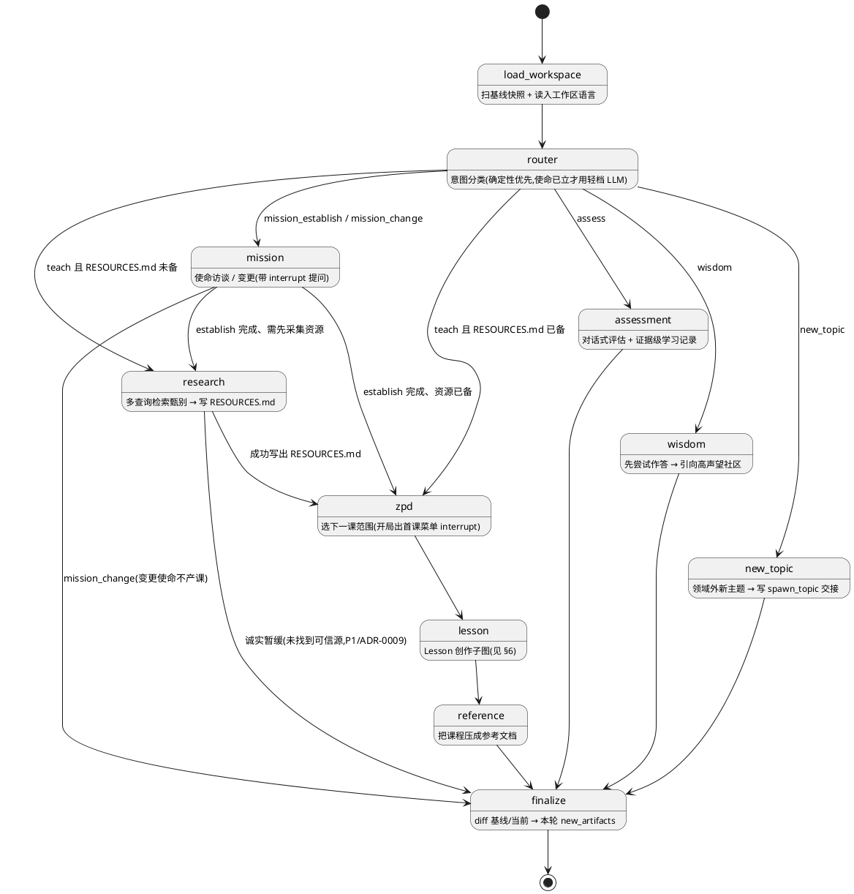
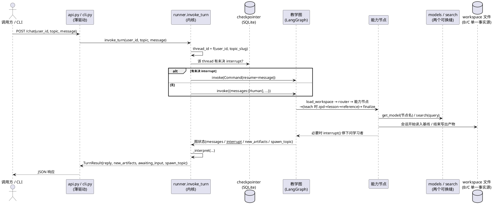
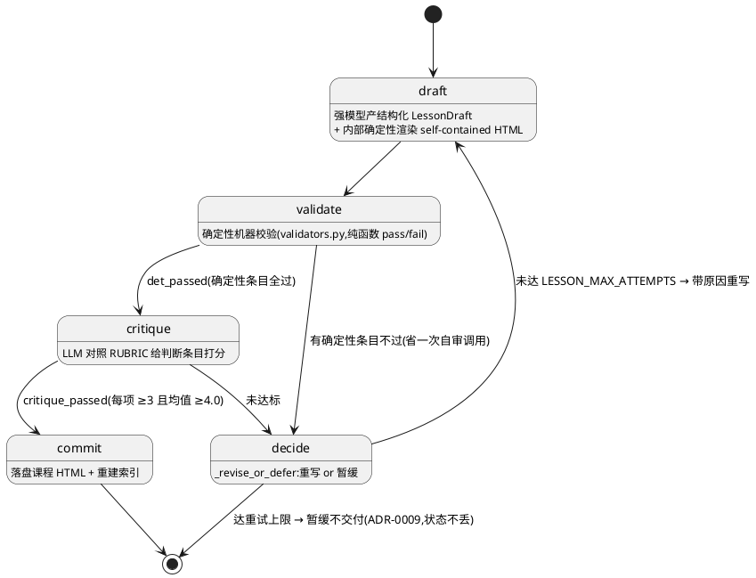

# 代码说明(架构 / 模块地图 / 如何修改)

本文档让你能**读懂并安全修改**这套代码。
部署与运行见 `OPERATIONS.md`;配置见 `docs/config.md`;产品决策见 `PRD.md`;架构决策记录见 `docs/adr/`;领域词汇见 `CONTEXT.md`;课程/智能体质量评分依据见 `RUBRIC.md`。

---

## 1. 核心心智模型

这个智能体是**一张结构化教学流水线图**(LangGraph),不是一个薄 ReAct agent(ADR-0001)。
节点按教学**能力**粗粒度拆分(Router / Mission / Research / ZPD / Lesson / Reference / Assessment / Wisdom),彼此通过一张共享状态 `TeachState` 通信。
每条学习者消息**调用一次图**,以 `thread_id = f(user_id, topic_slug)` 为键;有未决 interrupt 就 resume,否则 Router 才做意图分类。

三层状态、两种持久化机制(ADR-0003):

- **A 会话/图状态** → LangGraph checkpointer(SQLite)。即 `TeachState`,见 `state.py`。
- **B 长期记忆 + C 学习产物** → 工作区**普通文件**,是单一事实源。节点会话开始读入、结束写出,**不**镜像进图状态(避免双写)。

三条不可妥协的工程纪律:

1. **忠实承接 `teach`**:教学法 prompt / rubric 逐段、逐字承接 `teach/SKILL.md`,改动处在代码注释里标出处与原因。
2. **质量由架构保证**,不寄望模型一次写好:课程要过「机器校验 + 对照 RUBRIC 自审 + 不达标重写」。
3. **失败宁缺毋滥**:够不着可信资料就暂缓、坦白告知,绝不脑补(ADR-0009)。

---

## 2. 目录与模块地图

源码在 `src/self_learning_agent/`。

| 模块 | 职责 | 关键入口 |
| --- | --- | --- |
| `graph.py` | 装配并编译教学图;Router 与确定性路由;`finalize` 算本轮新产物 | `build_graph()` / `get_graph()` |
| `state.py` | 共享状态 schema(A 层) | `TeachState` |
| `runner.py` | 薄驱动内核:一条消息 → 一次图调用(resume 或新输入) | `invoke_turn()` / `TurnResult` |
| `cli.py` | 本地 REPL 驱动器 | `python -m self_learning_agent.cli` |
| `api.py` | FastAPI 驱动器(对话 / 产物 / 状态 / 重置 / 导出) | `app` / `create_app()` |
| `tenancy.py` | 多租户键推导 | `topic_slug()` / `thread_id()` |
| `workspace.py` | 工作区文件原语 + `RESOURCES.md` / `GLOSSARY.md` 渲染解析 + 三层记忆写入原语(Coverage Ledger / Learning Record / Learner Notes)+ 工作区语言持久化 + spacing 信号派生 | `read_text` / `write_text` / `scan_files` / `diff_new` / `append_learner_notes` / `read_learner_notes` / `read/write_workspace_language` / `derive_spacing_review` |
| `language.py` | Workspace Language(ADR-0013):语言检测 + 按语言码取 chrome 常量表(有限语言集,英文兜底,不翻译) | `detect_language()` / `chrome()` / `language_name()` |
| `config.py` | 集中配置 + 逐节点模型档位路由表 | `NODE_TIERS` / `PROVIDER_TIER_MODELS` / 各阈值 |
| `models.py` | 唯一碰具体模型的地方 | `get_model(node_name)` |
| `search.py` | 唯一外部信息工具,藏在可换接口后 | `search(query)` / `get_provider()` / `set_provider()` |
| `observability.py` | 唯一碰观测后端的地方(Langfuse 回调藏在缝后,ADR-0016) | `get_callbacks()` |
| `prompts.py` | 教学 prompt 架构(共享宪法层 + 节点专属切片) | `*_system()` 组装函数 |
| `mission.py` | Mission 能力节点(访谈 / 变更,带 interrupt) | `mission_node()` |
| `research.py` | Research 能力节点(多查询检索甄别 → 写 RESOURCES.md) | `research_node()` |
| `zpd.py` | ZPD/规划节点(选下一课范围;开局出首课菜单 interrupt,#016) | `zpd_node()` |
| `lesson.py` | Lesson 创作子图(起草→校验→自审→重写/暂缓) | `lesson_node()` / `build_lesson_subgraph()` |
| `validators.py` | 确定性机器校验器(纯函数,不调 LLM) | `validate_lesson()` / `all_passed()` |
| `reference.py` | Reference 节点(把课程压成参考文档)+ 词汇表维护 | `reference_node()` |
| `assessment.py` | 对话式评估节点(P6 学习记录纪律 / P7 词汇表纪律) | `assessment_node()` |
| `wisdom.py` | Wisdom 节点(先答 → 引导高声望社区) | `wisdom_node()` |
| `new_topic.py` | 新主题能力节点(#014):领域外新主题经确认 → 交接信号 `spawn_topic` | `new_topic_node()` |
| `scoring.py` | RUBRIC 评分缝(LLM-as-judge + 人评校准) | `judge_lesson()` / `run_calibration()` |
| `sanitize.py` | 系统边界护栏:落盘前清洗孤立代理项(每次 `write_text` 都过) | `sanitize_surrogates()` |

测试布局重组中:旧 `tests/` 目录已移除,测试缝的设计约定见 §11(重建测试时遵循)。
评分样本在 `scoring/samples/`。

---

## 3. 图拓扑与控制流



装配见 `graph.py:build_graph`(节点、边、条件边)。`mission`、`research` 出边是**图内条件边**(#013/ADR-0010),让一次调用在同轮自动级联走完 teach 路径直到交付首课或必须停下问学习者。

**Router 路由规则(`graph._route`,确定性优先)**:

- `MISSION.md` 未填充 → `mission`(establish 模式,**无需 LLM**)。
- 使命已立 → 轻档 LLM 判意图(`_RouterIntent` 五分类):`mission_change` → `mission`;`new_topic`(想学当前 mission 之外的**另一个领域**)→ `new_topic`;`assess` → `assessment`;`wisdom` → `wisdom`;否则 `teach`。
- `teach` 路径再看 `RESOURCES.md`:未备 → `research`(先采集资源,承接「资源充实前先找资源」);已备 → `zpd`(选下一课)。

**ZPD 开局首课菜单(#016/ADR-0011)**:`zpd` 在开局(尚无编号课)时产出 2–4 候选首课 + 推荐,并 `interrupt()` 呈现给学习者选;点名具体首课则直出,继续学则单选。故 `zpd → lesson` 并非无停顿直通——开局那轮会停在首课菜单上。

**`new_topic` 交接(#014/ADR-0011)**:确认学习者想学领域外新主题后,节点把主题名写入图状态 `spawn_topic`(**不**在旧 workspace 写任何文件),直接 `finalize`;由 driver(`runner`/`cli`/`api`)用新 `topic` 另起新 thread / 新记忆续调。

**轮内交接量**(A 层,不落产物文件):`zpd` 把 `next_lesson_scope` 交给 `lesson`;`lesson` 把 `last_lesson` 交给 `reference`(据 `committed` 决定是否产参考文档)。

**`finalize`** 对比会话开始的基线快照与当前快照,得出本轮 `new_artifacts`(`workspace.diff_new`)——任何节点只要写文件就被自动识别,无需各自登记。

---

## 4. 一次请求怎么流动

1. 调用方 `POST /chat`(或 CLI 一行输入)→ `runner.invoke_turn(user_id, topic, message)`。
2. `runner` 算 `thread_id`,查 checkpointer:有未决 interrupt → `graph.invoke(Command(resume=message))`;否则带新 `HumanMessage` 正常 invoke。
3. 图:`load_workspace`(扫基线)→ `router`(分类)→ 对应能力节点 →(teach 时 zpd→lesson→reference)→ `finalize`。
4. 能力节点按需调 `models.get_model(节点名)`、`search.search(query)`、`workspace.*` 读写文件、必要时 `interrupt()` 问学习者。
5. `runner._interpret` 把图返回解读成 `TurnResult{reply, new_artifacts, awaiting_input}`。

所有触网都收敛在 `models.get_model` 与 `search.search` 两处——这正是测试注入 fake 的两个缝。



---

## 5. Prompt 架构(承接 teach 的核心机制)

见 `prompts.py`。**逐段承接 SKILL.md,不整篇灌**,两层结构:

- **共享教学宪法层**(`constitution()`):只装真正横切的 SKILL.md 原文切片(Philosophy 三分、Fluency vs Storage、mission-grounding、Glossary 一致、Acquiring Wisdom),**逐字英文**,挂到触及它的每个节点。
- **节点专属切片**:`§Lessons`→Lesson、`§ZPD`→ZPD、`§Knowledge`→Research、`§Skills`→Assessment 等,逐字承接。

纪律:

- 能复用的原文**不改一字、不变语言(英文)**,注释标 SKILL.md 出处行号 + 「逐字承接,未改动」。
- 我们新增的 operator 指令(把「该做什么」转译成「产结构化输出」)也用英文,注释标「新增」与原因。
- **给学习者的产物随学习者语言**——这条写进发给 LLM 的指令,而非靠中文 prompt。

`RUBRIC.md` 是评分的**单一事实源**(一处定义,三处复用:课内自审、人评、LLM-judge),由 `prompts._read_rubric()` 加载嵌入,不抄进代码。

---

## 6. Lesson 创作子图(质量由架构保证)

见 `lesson.py`(ADR-0006)。一节课不是一次 LLM 调用,而是一张子图:



子图实际节点名:`draft` / `validate` / `critique` / `commit` / `decide`(`_revise_or_defer`)。HTML 渲染(`render_lesson_html`)是 `_draft` 内部调用的确定性辅助,**不是**独立子图节点。

要点:

- 模型只产**结构化字段**(`LessonDraft`:标题 / 正文块 / 引用 / 一手资源 / 测验 / 追问提醒 / 跨课链接 / 新组件);HTML 由确定性渲染器拼装。
- 共享样式表 `assets/lesson.css` 与课程索引 `lessons/index.html` 由代码确定性写入,使课程视觉一致、锚点可达。
- 测验内置 JS 即时判分(课程脱离后端可开);判分读的 `data-correct` 与 L9 校验读的是同一标记。
- 重试达 `LESSON_MAX_ATTEMPTS` 仍不达标 → **不交付**,只回「请稍后再来」,状态不丢(ADR-0009)。

**确定性条目 vs 判断条目的分工**:

- **确定性**(`validators.py`,纯函数 pass/fail):HTML 可解析、链接可达、L6 引用都在 RESOURCES、L7/L13 marker present、L9 测验无长度泄露、L12 跨文档锚点、L17 术语不用禁用别名。**100% 必须过**。
- **判断**(LLM 打分 1–5):L1/L2/L3/L4/L5/L8/L10/L11/L14/L15/L16。每项≥3 且均值≥4.0。

---

## 7. 评分缝(scoring.py)

`RUBRIC.md` 三处复用的第二、三处:

- `judgement_item_ids()` 从 `RUBRIC.md` **解析**判断条目(`*(Judgement)*` 标记),确定性条目与 L17 排除——RUBRIC.md 是「哪些条目该判断」的单一事实源。
- `judge_lesson()` 复用 `prompts.lesson_critique_system()`(与课内自审同一份 RUBRIC prompt)+ `lesson.LessonCritique` schema;只保留判断条目打分。
- `passes_threshold()` / `mean_score()` 是通过判定的**唯一定义**,`lesson._critique` 也复用它(三处不会漂)。
- `calibrate()` 把 judge 与人评对齐:逐项(exact / within_one / MAE)+ 判定一致性;`Calibration.calibrated` 据 `JUDGE_CALIBRATION_*` 判 judge 是否可作代理指标。
- `run_calibration()` 端到端跑批(回归监控)。

---

## 8. 模型层 / 搜索层(两个「可换旋钮」)

**模型层**(`config.py` + `models.py`):

- 每个节点绑一个档位(`NODE_TIERS`:STRONG/MID/LIGHT),每个 provider 给档位映射模型名(`PROVIDER_TIER_MODELS`)。
- 换默认 provider = 改 `LLM_PROVIDER` 一处;换某节点档位 = 改 `NODE_TIERS` 一行;业务节点零改动。
- 取模型唯一入口 `models.get_model(node_name)`。

**搜索层**(`search.py`,ADR-0007 极简工具面):

- 唯一外部信息工具,藏在 `search(query) -> [Candidate]` 接口后;**不上 MCP / RAG / 向量库 / reranker**。
- 换源 = 改 `SEARCH_PROVIDER` 并在 `_build_default_provider` 登记,或进程内 `search.set_provider(...)`。
- 约定:够不着返回空列表;Research 节点据此走失败姿态,绝不脑补。

---

## 9. 工作区文件约定

见 `workspace.py`。每个 `(user_id, topic_slug)` 一个隔离目录:

```
workspaces/{user_id}/{topic_slug}/
  workspace.json             # 工作区元数据:持久化 Workspace Language `{"language":"zh"}`(B,ADR-0013)
  MISSION.md                 # 使命(B)
  RESOURCES.md               # 高信任资源,Knowledge / Wisdom 分组(B)
  GLOSSARY.md                # 术语词汇表(B)
  NOTES.md                   # Learner Notes:偏好/节奏/反复卡点/未解决疑问/系统背景(B,记忆三层之三,ADR-0012)
  learning-records/NNNN-*.md # 证据级学习记录,含 Implications/Evidence/Status + supersession(B,ADR-0012)
  lessons/NNNN-*.html        # 课程 + index.html;含 manifest.json = Coverage Ledger(C,记忆三层之一)
  reference/NNNN-*.html      # 参考文档 + index.html(C)
  assets/lesson.css 等       # 可复用组件(C)
```

**记忆三层(ADR-0012,补偿宿主 ambient 记忆)**:Coverage Ledger(`lessons/manifest.json`,教过什么→防重复)、Learning Record(学会什么→前瞻选课,证据级纪律不松)、Learner Notes(`NOTES.md`,偏好/卡点/疑问)。三层都由 `workspace.py` 的确定性原语写(「怎么写」收敛在原语,「何时写」是节点的教学判断),并注入 `zpd`/`lesson`/`mission` 的 prompt。spacing「该复习什么」信号由 `derive_spacing_review` 据 Coverage Ledger 时间戳 + `TEACH_SPACING_REVIEW_DAYS` 派生喂 ZPD。

**Workspace Language(ADR-0013)**:Mission 确立时 `detect_language` 检测一次、写入 `workspace.json`,下游节点 prompt 与确定性渲染器都读它——内容随语言由模型产出,结构性 chrome 由 `language.chrome(lang)` 从常量表取(不翻译),`<html lang>` 由语言码设定。

`RESOURCES.md` / `GLOSSARY.md` / `NOTES.md` 都有**唯一**的确定性渲染器 + 解析器(避免多节点写同一文件时格式漂移);解析器只需兼容自己渲染器的输出。
编号文件(`NNNN-`)由 `next_*_number` 扫描自增。

---

## 10. 如何修改 / 扩展(配方)

**加一个模型 provider**:① `config.PROVIDER_TIER_MODELS` 加一档位映射;② `models._build` 加构造分支(读对应 `*_API_KEY`);③ `.env.example` 补占位。

**给某节点换档**:改 `config.NODE_TIERS` 一行。

**改某段教学 prompt**:在 `prompts.py` 找到对应切片。逐字承接区**不要改**;要扩展就加新的 operator 指令常量,注释标「新增」与原因(忠实承接是硬纪律)。

**调质量阈值**:改 `config.LESSON_MAX_ATTEMPTS` / `CRITIQUE_MIN_ITEM` / `CRITIQUE_MIN_MEAN`(自审与 judge 同时生效)。

**加一条确定性校验**:在 `validators.py` 写一个 `check_*(html, ...) -> CheckResult` 纯函数,加进 `validate_lesson` 列表,补单测。仅当它真能用代码判定(否则归判断条目)。

**加一个判断条目**:在 `RUBRIC.md` 标 `*(Judgement)*`;`scoring.judgement_item_ids()` 会自动纳入,自审 prompt 也据 RUBRIC 打分。

**加一个能力节点**:① 写 `xxx.py` 的 `xxx_node(state) -> dict`;② 在 `graph.build_graph` `add_node` + 接边;③ 若由 Router 分流,扩 `_RouterIntent` 与 `_route`;④ 给 prompt 切片;⑤ 写 `test_xxx_seam.py`。注意承接原则:别重新设计 teach 的教学法,只做独立化所需的增量。

**换会话存储(SQLite→Postgres)**:改 `graph._default_checkpointer`。

**加评分样本**:往 `scoring/samples/` 加 HTML + 在 `manifest.json` 写人评分(只打判断条目)。

---

## 11. 测试缝(只验外部行为)

> 具体测试文件正在重组、暂已移除;本节是**测试缝的设计约定**——重建测试时按此布置(每个能力一个 `test_*_seam.py`,共享夹具 `conftest.py` 注入确定性 fake 模型 / mock 搜索 / 临时工作区)。

| 缝 | 测什么 | 怎么 hermetic |
| --- | --- | --- |
| 图层缝(主缝) | `invoke_turn` / `graph.invoke`:路由、interrupt/resume、跨会话续接、本轮产物 | `conftest.models_director` 注入确定性 fake 模型;`search_director` 注入 mock 候选;`isolated_workspaces` 指临时目录 |
| 确定性校验器缝 | `validators.*` 纯函数对 HTML fixture 直测 | 无需模型 |
| `search()` 接口缝 | Research 甄别 + RESOURCES 写入 + 失败姿态 | 注入 mock 候选,不触网 |
| 节点缝 | 单节点 `(state)->更新`(仅图层缝不足以定位时) | 同上 |
| rubric 评分缝 | `scoring.*`:解析 / 阈值 / 过滤 / 校准 | judge 调用经 `models_director` mock |

`conftest.py` 的 fake 模型 responder 是**纯函数**(`(node_name, messages, schema) -> 输出`):因为 LangGraph 的 `interrupt()` 在 resume 时会让节点**从头重跑**,纯函数对同输入恒返回同输出,才能让多个 interrupt 的索引跨重跑对齐。

确定性条目 = 硬门槛(必须 100% 过);判断性条目 = rubric 打分(人评权威 + LLM-judge 代理)。

---

## 12. 承接审计

`RUBRIC.md` 已对照 `SKILL.md` + 四个 FORMAT 文件做完整审计:L1–L17 逐条标出处与「确定性校验 vs 人/LLM 判断」归类,P1–P7 为 agent 行为层标准。
每一处对原 SKILL.md 的修改/扩展在代码注释里都标了对应原文段落与原因——审计「承接是否忠实」时从这些注释入手。
SKILL.md frontmatter 作为 Claude Code 宿主配置自然失效(无独立等价物),不贡献评分标准。
